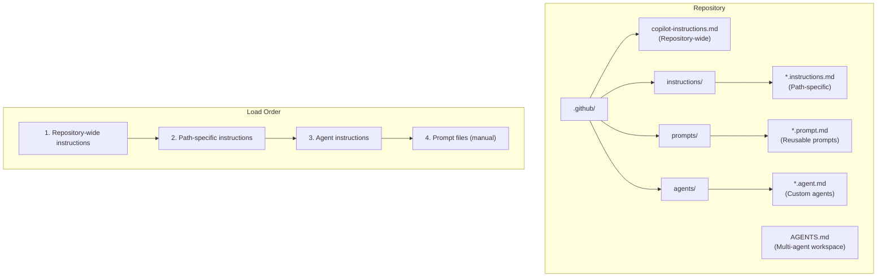

# GitHub Copilot AI Template

A Test-Driven Development (TDD) boilerplate template for AI-powered development with GitHub Copilot.

## Overview

This repository provides a boilerplate template for starting new projects with GitHub Copilot and Test-Driven Development (TDD) best practices.

Inspired by [christianlempa/boilerplates](https://github.com/christianlempa/boilerplates), this template enforces a test-first development workflow using the official GitHub Copilot customization files.

## File Hierarchy

## Officially Supported Files

Based on official GitHub Copilot documentation:

| File                                     | Purpose                                         | Max Characters |
| ---------------------------------------- | ----------------------------------------------- | -------------- |
| `.github/copilot-instructions.md`        | Repository-wide instructions, auto-loaded       | 8,000          |
| `.github/instructions/*.instructions.md` | Path-specific instructions with `applyTo` globs | 8,000          |
| `.github/prompts/*.prompt.md`            | Reusable prompt templates (public preview)      | 8,000          |
| `.github/agents/*.agent.md`              | Custom agent profiles (public preview)          | 30,000         |
| `AGENTS.md`                              | Multi-agent workspace instructions              | 30,000         |

## Context Window Limits

GitHub Copilot enforces character limits on instruction files to manage context windows effectively.

### Character Limits by File Type

| File Type                  | Max Characters | Recommended Range | Notes                              |
| -------------------------- | -------------- | ----------------- | ---------------------------------- |
| Repository instructions    | 8,000          | 2,000-6,000       | Auto-loaded for all requests       |
| Path-specific instructions | 8,000          | 1,000-4,000       | Loaded based on `applyTo` patterns |
| Prompt files               | 8,000          | 1,000-4,000       | Manually invoked                   |
| Custom agents              | 30,000         | 5,000-20,000      | Includes YAML frontmatter          |
| Code review instructions   | 4,000          | 1,000-3,000       | Specific to code review feature    |

### Best Practices

- Keep instructions concise and focused
- Use path-specific instructions to reduce repository-wide instruction size
- Split large agent prompts into multiple specialized agents
- Monitor total context usage across all loaded instruction files

## Quick Start

1. Use this template to create a new repository
2. Ensure GitHub Copilot is enabled in your IDE
3. Open Copilot Chat and start with TDD

## Resources

### Official Documentation

- [GitHub Copilot Documentation](https://docs.github.com/copilot)
- [Custom Instructions Guide](https://docs.github.com/copilot/customizing-copilot/adding-custom-instructions-for-github-copilot)
- [Custom Agents Configuration](https://docs.github.com/copilot/reference/custom-agents-configuration)
- [VS Code Custom Instructions](https://code.visualstudio.com/docs/copilot/customization/custom-instructions)
- [VS Code Prompt Files](https://code.visualstudio.com/docs/copilot/customization/prompt-files)

### Inspiration

- [christianlempa/boilerplates](https://github.com/christianlempa/boilerplates)
